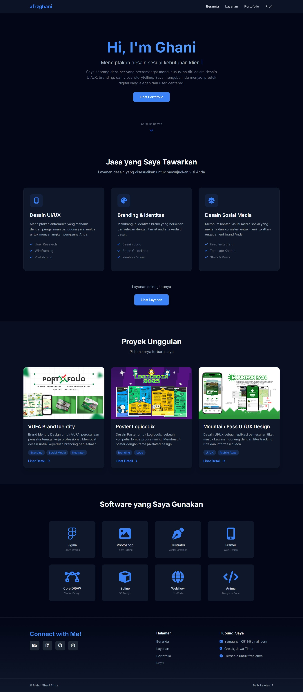
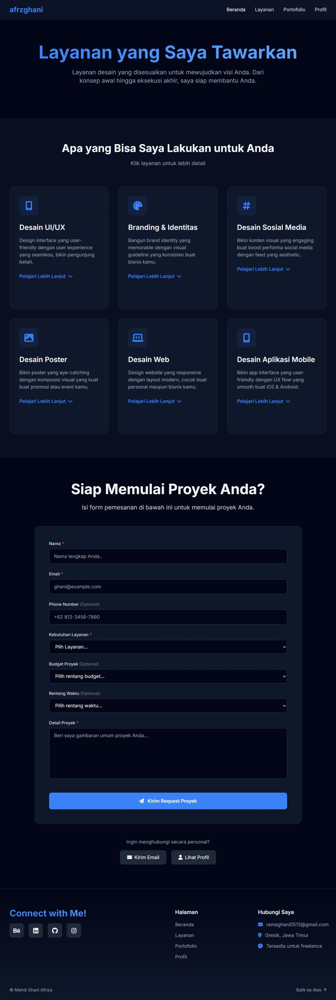
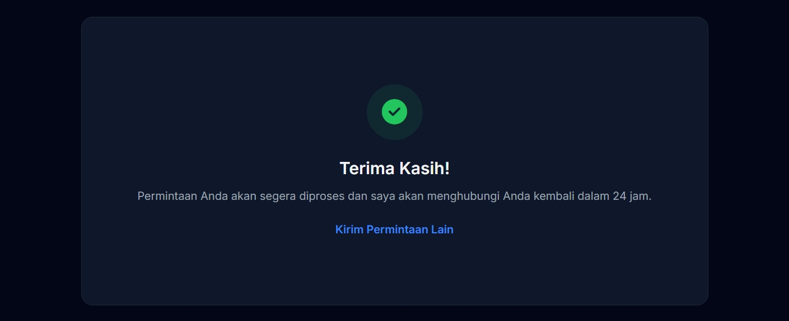
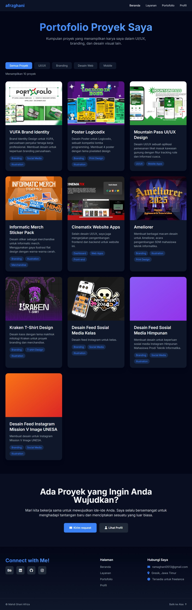
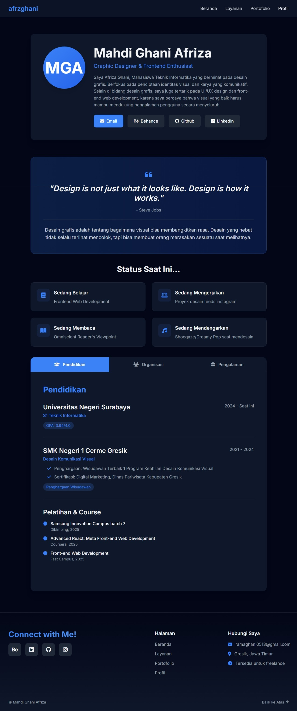

# Portfolio Pribadi - Project UTS PBP

Website portofolio pribadi ini merupakan proyek tugas untuk mata kuliah **Pemrograman Berbasis Platform (PBP)**.  
Dibangun dengan **HTML**, **TailwindCSS v3**, dan **JavaScript**.

Kunjungi Website: https://portfolio-ghani.vercel.app/  

---

## Deskripsi Proyek
Website ini berfungsi sebagai portofolio untuk menampilkan karya, layanan, serta profil profesional dengan style **minimalis, responsif, dan bersih**, agar fokus utama tetap pada konten dan karya desain.

---

## Struktur Halaman
Website terdiri dari **4 halaman utama**:

### 1. Beranda (`index.html`)
Menampilkan:
- Perkenalan singkat.
- 3 proyek unggulan.
- Menampilkan ikon-ikon teknologi yang digunakan.

### 2. Layanan (`services.html`)
Menampilkan daftar **layanan atau jasa desain** yang ditawarkan.

### 3. Proyek (`projects.html`)
Menampilkan daftar lengkap karya desain:
- Setiap proyek memiliki gambar/thumbnail, judul, dan deskripsi singkat.
- Disusun dalam layout grid
- Dapat dikembangkan lebih lanjut dengan detail proyek (pengembangan).

### 4. Profil (`profile.html`)
Menampilkan informasi tentang diri:
- Foto profil, nama, bio singkat, dan link ke media sosial profesional
- Tab navigasi:
  - **Pengalaman**
  - **Pendidikan**
  - **Organisasi**

---

## Teknologi yang Digunakan
- **HTML5**  
- **TailwindCSS v3**  
- **JavaScript**  
- **Font Awesome**  
- **Vercel**  

---

## Rencana Pengembangan
- Integrasi Backend (Next.js atau MERN stack)  
- Integrasi dengan EmailJS untuk pengiriman request.  
- Detail tiap proyek portofolio
- SEO untuk menambah engagement website
- ....

---

## Preview Tampilan Website
### Home

### Layanan/Services

### Submit Order

### Portofolio

### Profile

---

## 👨‍🎓 Informasi Proyek
- **Nama (NIM):** Mahdi Ghani Afriza (24051204119)  
- **Mata Kuliah:** Pemrograman Berbasis Platform (PBP)  
- **Proyek:** Portfolio Pribadi  
- **Tujuan:** Membuat website portofolio menggunakan HTML, TailwindCSS, dan JavaScript.  
- **Dosen Pengampu:** Rifqi Abdillah, S.Tr.T., M.Kom.

---

## Dokumentasi Presentasi
[Lihat Video Presentasi di Youtube](https://www.youtube.com/watch?v=u1P7O7GCQjE?si=sPh-W5gD3Z98iVjp)